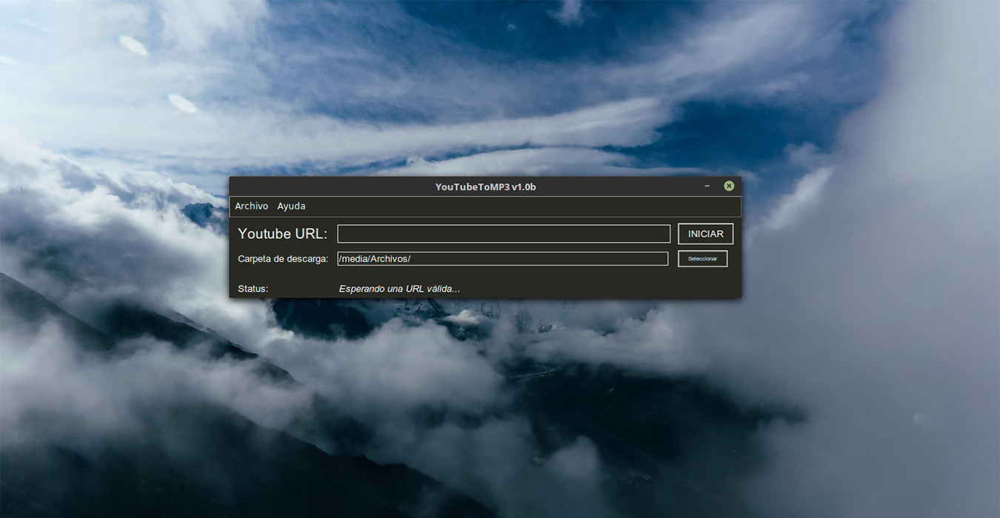
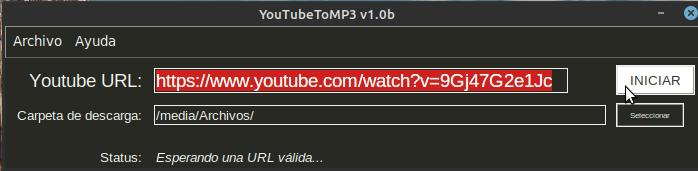

# YoutubeToMP3 1.02

Una simple app de escritorio que que permite descargar música en formato MP3 desde Youtube. 

- Creado con ***Python 3*** y empleando ***Tkinter*** para la GUI.
- Usando ***Youtube_dl*** para descargar y convertir los videos a MP3 (que a su vez emplea  ***FFmpeg*** para la conversión de video a audio).

## Instalación:

- [Descargar el zip](./download/) según el sistema operativo* disponible (Linux/Win/Mac).
- Descomprimir y ejecutar el binario que viene dentro.

###### * Testeado de momento solo en Linux Mint, en versiones 18.3 y 19.2. A testear en Windows 10 en un futuro próximo. Sin planes para portar y testear en Mac.

## Uso:

Para descargar música, basta con copiar y pegar la url del video y elegir una carpeta de destino:

### Más info:
- [Youtube_dl Doc](https://github.com/ytdl-org/youtube-dl/blob/master/README.md)
- [FFmpeg Documentation](https://ffmpeg.org/documentation.html/)
